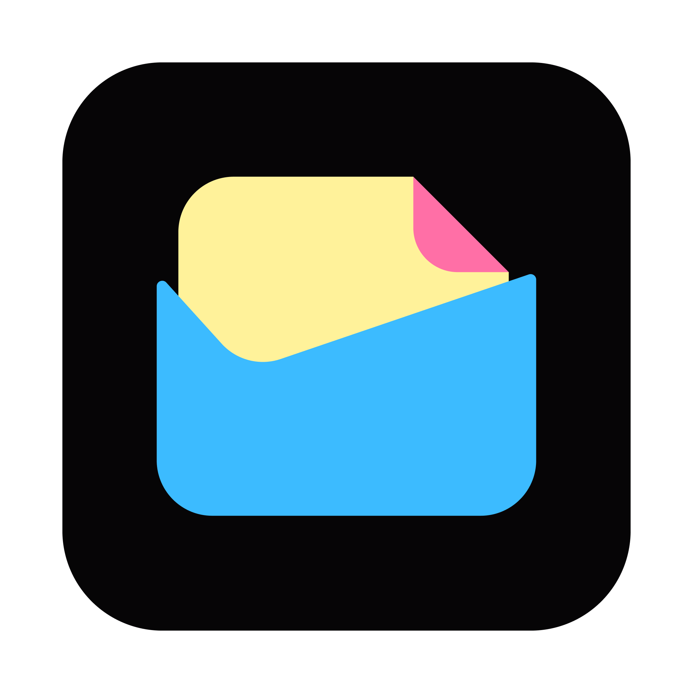
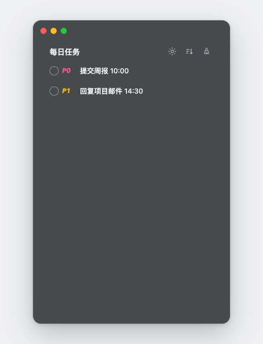

# 每日待办

一个常驻 macOS 桌面的轻量待办工具。点击桌面圆球展开任务，完成后直接勾选，不需要打开完整的任务管理软件。

<p align="center">
  
</p>

## 演示

<p align="center">
  
</p>

## 功能

- 桌面悬浮圆球，点击即用
- P0、P1 和会议任务标记
- 按任务末尾时间排序
- 深色与浅色模式
- 本地数据存储，不上传任务内容
- Apple Silicon 和 Intel Mac 通用构建

## 下载

请前往 [Releases](../../releases/latest) 下载最新 DMG。

当前构建没有 Apple Developer ID 公证。首次启动时：

1. 将“每日待办.app”拖入“应用程序”。
2. 在 Finder 中右键应用，选择“打开”。
3. 在系统确认框中再次选择“打开”。

## 从源码构建

需要 macOS 12 或更高版本，并安装 Xcode Command Line Tools。

```bash
git clone https://github.com/caoyiqin29/Donna.git
cd daily-todo-macos
./scripts/build.sh
open build/每日待办.app
```

构建脚本会针对当前 Mac 的架构生成应用。Releases 中的官方安装包同时支持 Apple Silicon 和 Intel Mac。

## 数据位置

待办数据保存在：

```text
~/Library/Application Support/FloatingTodo/
```

## 反馈与贡献

- 问题与建议请提交 [Issue](../../issues)。
- 代码贡献请先阅读 [CONTRIBUTING.md](CONTRIBUTING.md)。

## License

[MIT](LICENSE)
